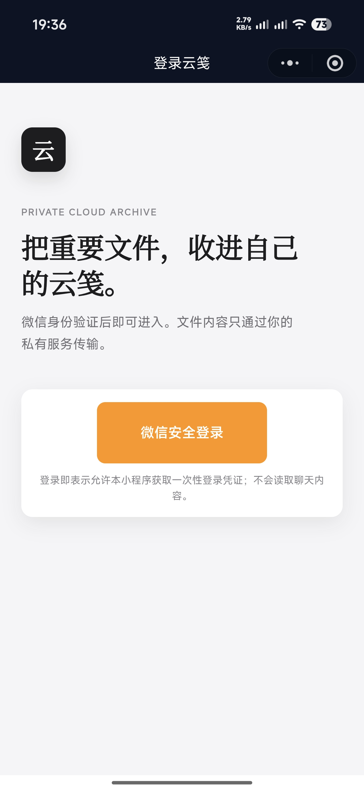

# 云笺 Cloud Note

一个基于微信小程序的个人私有云盘项目。

支持文件上传、文件夹管理、文件搜索、回收站、批量删除、文件重命名与 MinIO 对象存储。

> 适合个人学习、私有文件归档与 Spring Boot / 微信小程序全栈实践。

## 项目预览

> 可在 `docs/images/` 中放入项目截图后，取消下面图片链接的注释。

<!--



-->

## 功能

- 微信小程序登录
- 文件上传与下载
- 文件夹创建与层级管理
- 文件重命名、移动与删除
- 文件搜索
- 回收站恢复与永久删除
- 批量管理文件与文件夹
- MinIO 对象存储
- Redis 缓存
- JWT 登录鉴权
- 文件分享与访问密码保护

## 技术栈

| 模块 | 技术 |
| --- | --- |
| 小程序 | 原生微信小程序 |
| 后端 | Spring Boot 3 |
| JDK | Java 17 |
| ORM | MyBatis-Plus |
| 数据库 | MySQL 8.0+ |
| 缓存 | Redis |
| 对象存储 | MinIO |
| 构建工具 | Maven |

## 项目结构

```text
cloud-note
├── cloud-miniapp/     # 微信小程序
├── cloud-server/      # Spring Boot 后端
│   ├── sql/           # 数据库初始化脚本
│   └── src/main/      # 后端源码
├── docs/              # 项目文档与截图
├── LICENSE
└── README.md
```

## 本地启动

### 1. 准备环境

请先安装并启动：

- JDK 17
- MySQL 8.0+
- Redis
- MinIO
- Maven
- 微信开发者工具

### 2. 初始化数据库

创建数据库：

```sql
CREATE DATABASE cloud_disk DEFAULT CHARACTER SET utf8mb4;
```

然后执行：

```text
cloud-server/sql/schema.sql
```

如果 `sql` 目录中包含升级脚本，请按照脚本说明依次执行。

### 3. 配置环境变量

后端配置文件位于：

```text
cloud-server/src/main/resources/application.yml
```

项目使用环境变量读取敏感配置。开发环境至少需要配置：

| 环境变量 | 示例值 |
| --- | --- |
| DB_USERNAME | root |
| DB_PASSWORD | 你的 MySQL 密码 |
| REDIS_HOST | localhost |
| REDIS_PORT | 6379 |
| MINIO_ENDPOINT | http://localhost:9000 |
| MINIO_ACCESS_KEY | minioadmin |
| MINIO_SECRET_KEY | minioadmin |
| MINIO_BUCKET | cloud-disk |
| WECHAT_APP_ID | 你的微信小程序 AppID |
| WECHAT_APP_SECRET | 你的微信小程序 AppSecret |
| JWT_SECRET | 请自行生成足够长的随机字符串 |

> 不要将真实数据库密码、AppSecret、MinIO 密钥或 JWT 密钥提交到 GitHub。

### 4. 启动后端

使用 IntelliJ IDEA：

1. 打开 `cloud-server`。
2. 在运行配置中填入上述环境变量。
3. 运行 `CloudDiskApplication`。
4. 浏览器访问：

```text
http://localhost:8080/api/health
```

返回成功响应，说明后端已经启动。

### 5. 启动小程序

1. 使用微信开发者工具导入 `cloud-miniapp`。
2. 打开：

```text
cloud-miniapp/utils/config.js
```

3. 本机调试时使用：

```js
const SERVER_URL = 'http://127.0.0.1:8080';
```

4. 真机调试时，改为电脑局域网 IP，例如：

```js
const SERVER_URL = 'http://192.168.x.x:8080';
```

5. 在微信开发者工具中编译运行。

## 真机与正式发布说明

本地调试时，可临时关闭微信开发者工具的合法域名校验。

正式发布小程序前必须：

- 使用公网服务器。
- 配置 HTTPS 域名。
- 在微信公众平台配置合法请求域名。
- 将 `SERVER_URL` 改为 HTTPS 域名。
- 使用真实 AppID。
- 不上传真实 AppSecret。

## 常见问题

### 小程序无法连接后端

检查：

- 后端是否已启动。
- `SERVER_URL` 是否填写正确。
- 真机调试时，手机与电脑是否在同一局域网。
- Windows 防火墙是否允许 8080 端口。
- 微信开发者工具是否临时关闭了本地开发域名校验。

### MinIO 无法上传

检查：

- MinIO 服务是否启动。
- `MINIO_ENDPOINT` 是否正确。
- Bucket 是否已创建。
- Access Key 与 Secret Key 是否正确。

### 数据库报错

检查：

- 是否使用 MySQL 8.0+。
- 是否已经执行 `cloud-server/sql/schema.sql`。
- 数据库名称、账号和密码是否正确。

## 开源协议

本项目采用 [MIT License](LICENSE)。

## 后续计划

- [ ] 文件预览
- [ ] 图片缩略图
- [ ] 文件分享链接二维码
- [ ] 文件容量统计
- [ ] 深色模式
- [ ] Docker 部署
- [ ] 自动化测试与 GitHub Actions

## 作者

xiaozhu
